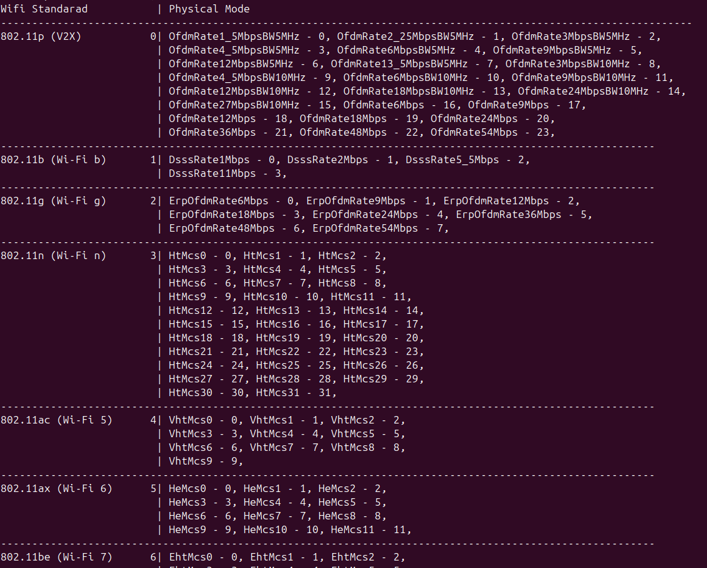
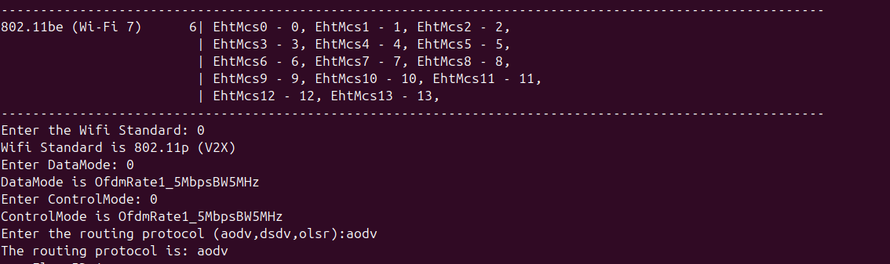
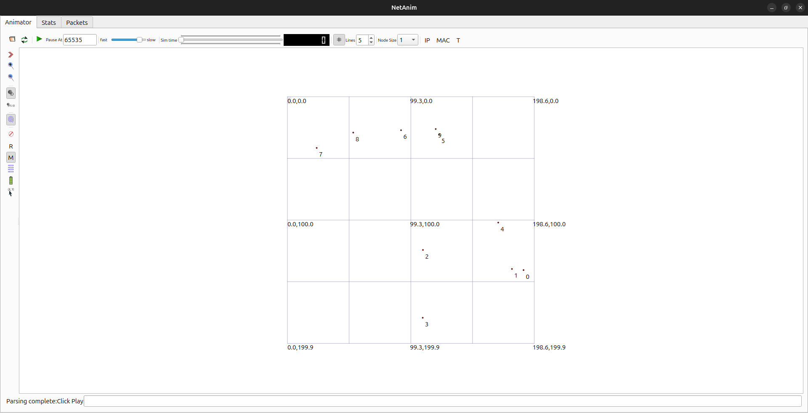
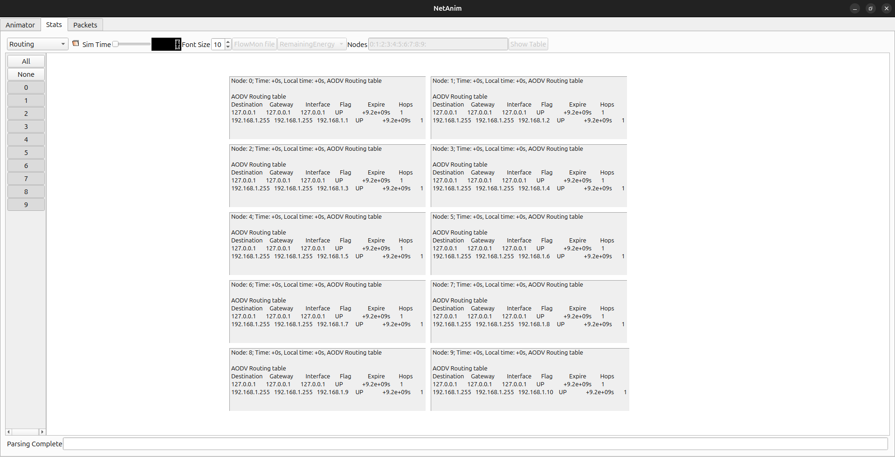
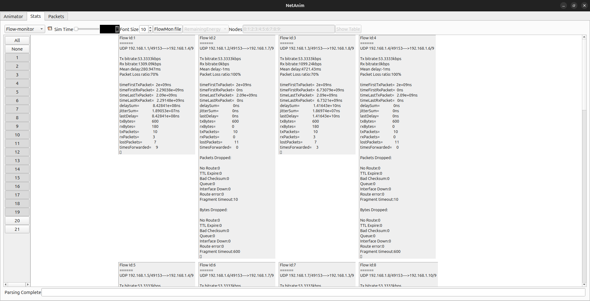
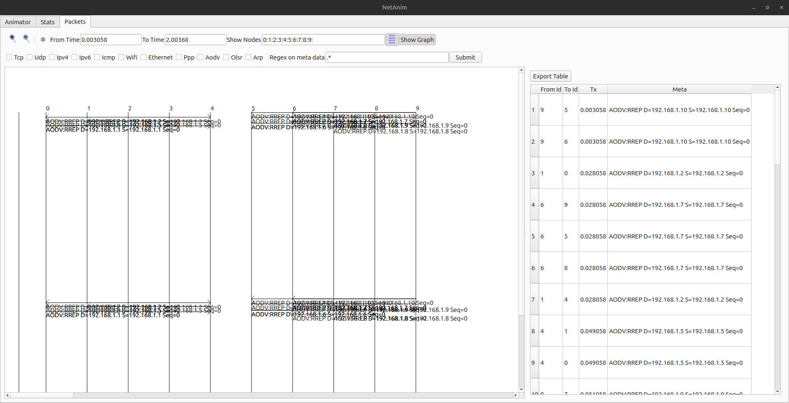

# Simulation and comparison of wifi standards for MANET protocol
1. Introdcution

    + This project compares the performance of MANET protocols through the following parameters:

        + number of nodes
        + wifi standart
        + protocol

    + Simulated and visualized using **NetAnim**

2. Version

    + **Ubuntu 24.04 LTS** (local)
    + **NS-3 3.43**
    + **NetAnim 3.108**

3. Deployment

    + Download and install **NS-3 3.43** and **NetAnim 3.108** at [NS-3 official](https://www.nsnam.org/)
    + Clone this repo and copy manet.cc and manet_mobility.cc files to ./scratch folder in **ns-3** folder

4. Run simulation

    + open terminal at **ns-3** folder
    + you can choose to run the old version (manet.cc) without wifi standard and non-mobility nodes, here we run the full version (manet_mobility.cc)
    ```
    ./ns3 run scratch/manet_mobility.cc
    ```

    + enter number of nodes
    
    
    
    + enter wifi standart and physical mode 
    + enter physical mode
    + enter routing protocol

    
    

5. Result

    + You can monitor the results including information such as packet loss rate, throughput...etc.

    

6. NetAnim 3.108

    + After running the simulator, it will create 3 files in the ns-3 folder including:
        
        + manet.xml
        + manet-flow_monitor.xml
        + manet-routing.xml

    + You can open them with netanim and observe the result 

    
    
    
    

7. References
    
    + [maahmed24712/Comparison-of-Manet-Routing-Protocols](https://github.com/maahmed24712/Comparison-of-Manet-Routing-Protocols)
    